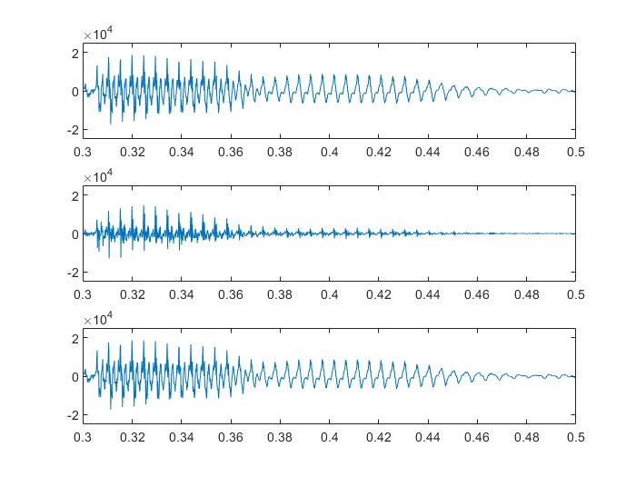

# 信号与系统——MATLAB综合实验之语音合成

## 语音预测模型

### (1) 离散时间系统

对于给定的差分方程$e(n) = s(n) - a_1 s(n-1) - a_2 s(n-2)$，作z变换有$E(z) = S(z) - a_1 z^{-1} S(z) - a_2 z^{-2} S(z)$，因此有传递函数：

$$H(z) = \frac{1}{1-a_1 z^{-1} -a_2 z^{-2}}$$

对于$a_1 = 1.3789, a_2 = -0.9506$，求极点`roots([1 -1.3789 0.9506])`可得两共轭虚根$p_{1,2} = 0.6895 \pm 0.6894\mathrm{i}$，上半平面的虚根辐角为`angle(0.6865 + 0.6894i)`为$\Omega = 0.7854\ \mathrm{rad}$。从而共振峰频率$f=\frac{\omega}{2\pi}=\frac{\Omega}{2\pi T} = \frac{0.125}{T} \mathrm{Hz} = 0.125f_s$，其中$T$为抽样间隔，$f_s$为抽样频率。对于$f_s = 8\mathrm{kHz}$，有共振峰频率$f = 1\mathrm{kHz}$。

该差分方程的零极点图、频率响应、单位样值响应分别如下所示。

**零极点图**


两个极点与先前所述一致，辐角$\pm \frac{\pi}{4} = 0.7854\ \mathrm{rad}$，有二阶零点0。

**频率响应**


由幅频响应特性可见，有共振峰处于$0.25\pi = 0.7854\ \mathrm{rad}$上，符合理论计算。

**单位样值响应**


可以看到使用`filter`与`impz`得到的单位样值响应是一样的。

具体源代码如下：

```matlab
clear; clc; close all;

a = [1, -1.3789, 0.9506];

% Compute peak frequency
p = roots(a);
fprintf("Frequency: %f = %f * pi\n", angle(p(1)), angle(p(1)) / pi);

% Draw zero and pole points
figure;
zplane(1, a);

% Draw amplitude and phase with regard to frequency
figure;
freqz(1, a);

% Draw impulse response
figure;
% Use filter to generate impulse response
subplot(2, 1, 1);
n = (0:100)';
x = (n == 0);
y = filter(1, a, x);
stem(n, y, 'filled');
title('Impulse Response: filter');
xlabel('n (samples)');
ylabel('Amplitude');
% Use impz
subplot(2, 1, 2);
impz(1, a, 101);
title('Impulse Response: impz');

```

### (2) 阅读`speechproc.m`程序，理解基本流程

该程序基本流程如下：

1. 定义常数、载入语音
2. 定义各滤波器的激励、响应、状态变量，以及其它一些辅助变量
3. 依次处理每帧语音：
   1. 计算预测系数
   2. 进行到27帧时，观察零极点分布图
   3. 提取本帧语音`s_f`，使用`filter`函数和`s_f`计算激励`exc`，同时保持滤波器状态（下同）
   4. 使用`filter`函数和`exc`重建语音`s_rec`
   5. 计算基音周期`PT`和合成激励的能量`G`
   6. 利用`PT`和`G`生成合成激励，并用`filter`函数和合成激励重建语音`s_syn`
   7. 将合成激励长度增加一倍，再作为`filter`的输入，合成语音`s_syn_v`，实现变速不变调
   8. 将基音周期减小一半，共振峰频率增加150Hz，再作为`filter`的输入，合成语音`s_syn_t`，实现变调不变速
4. 听上述语音并保存

### (3) 观察27帧时零极点图

在`if n == 27`的条件后添加产生零极点图的代码：

```matlab
figure;
zplane(A, 1);
title('27帧时刻预测系统零极点分布图');
```

生成零极点图如下所示。


这里值得注意的是，预测模型与生成模型的激励、响应相反，因此输入`zplane`的参数应从`1,A`调换为`A,1`，即传递函数变为原先传递函数的倒数。零极点也与生成模型的零极点对调。27帧时，预测模型有10个单位圆内的零点，两两共轭，以及十重极点0。这对应于生成模型的五对共轭极点和十重零点0。这是典型的男声，含五个共振峰频率。

### (4) 计算激励信号

`[exc((n-1)*FL+1:n*FL), zi_pre] = filter(A, 1, s_f, zi_pre);`

使用`filter`将本帧语音`s_f`输入得到激励信号，通过`zi_pre`保持滤波器状态，使用上一帧留下的`zi_pre`作为本帧的`zi`，并将`zf`继续写入`zi_pre`。这里虽然每帧预测系统本身不同，但相邻两帧滤波器状态仍然不发生变化。

### (5) 重建语音

`[s_rec((n-1)*FL+1:n*FL), zi_rec] = filter(1, A, exc((n-1)*FL+1:n*FL), zi_rec);`

使用`filter`将激励信号输入得到重建的语音`s_rec`，因为合成系统与预测系统输入输出相反，传递函数互为倒数，因此`filter`中`A, 1`颠倒为`1, A`，同样要保持滤波器状态`zi_rec`。

### (6) 试听信号

使用`sound`函数试听原始信号`s`、激励信号`e`和合成信号`s_rec`。使用如下代码，此处将`s`、`exc`、`s_rec`三个列向量拼接在一起连续试听。这里需要注意的是，`sound`函数接收的是[-1, 1]范围的信号，传递给扬声器，而我们所处理的音频都为16bit，需要除去2^15将其限定在[-1, 1]范围中。采样率`Fs = 8000;`。此处代码与提交的`speechproc.m`中不同，因为提交代码中试听所有六个音频，作六个音频的时域、频域图，下同。

`sound([s; exc; s_rec] / 2^15, Fs);`

`s`与`s_rec`应完全相同（经过预测系统及其逆系统生成系统保持不变），`exc`是经过声管前的激励。实际听上去，`s`与`s_rec`非常清晰，是一样的语音“电灯比油灯进步多了”；而`exc`虽然也能听出是这句话，但音量较轻，且听起来不够圆滑，是原始的气管气流激励，有较强的冲激音效，声音不够饱满。

作出`s`、`exc`、`s_rec`三个信号图如下图所示，由上至下依次为`s`、`exc`、`s_rec`（即$s(n)$、$e(n)$、$\hat{s}(n)$）。图中横纵坐标相统一以便于比较，下同。代码如下，其中`time`是由离散时间结合采样率转换为连续时间：

```matlab
figure;
time = (0:L-1) / Fs;    % 由采样率生成对应时间
subplot(3, 1, 1);
plot(time, s);
ylim([-2.5e4, 2.5e4]);
subplot(3, 1, 2);
plot(time, exc);
ylim([-2.5e4, 2.5e4]);
subplot(3, 1, 3);
plot(time, s_rec);
ylim([-2.5e4, 2.5e4]);
```


这也可以看出`s`和`s_rec`完全一致，而`exc`则幅度较小。

选择其中一小段，放大观看。选择的是0.3s-0.5s的时间，在采样率8000Hz时，对应的是第2400-4000个采样点。具体代码如下：

```matlab
figure;
subplot(3, 1, 1);
plot(time(2400:4000), s(2400:4000));
ylim([-2.5e4, 2.5e4]);
subplot(3, 1, 2);
plot(time(2400:4000), exc(2400:4000));
ylim([-2.5e4, 2.5e4]);
subplot(3, 1, 3);
plot(time(2400:4000), s_rec(2400:4000));
ylim([-2.5e4, 2.5e4]);
```



可以看出`s`和`s_rec`完全一致，在小范围中，语音信号有明显的周期特征。（这一段时间对应于第一个“灯”字，可看见明显有d，ɤ，ŋ三个音，其中d的能量最大，其余两个为鼻音，能量较小。