# 信号与系统——MATLAB综合实验之语音合成

无81 马啸阳 2018011054

## 语音预测模型

### (1) 离散时间系统

对于给定的差分方程$e(n) = s(n) - a_1 s(n-1) - a_2 s(n-2)$，作z变换有$E(z) = S(z) - a_1 z^{-1} S(z) - a_2 z^{-2} S(z)$，因此有传递函数：

$$H(z) = \frac{1}{1-a_1 z^{-1} -a_2 z^{-2}}$$

对于$a_1 = 1.3789, a_2 = -0.9506$，求极点`roots([1 -1.3789 0.9506])`可得两共轭虚根$p_{1,2} = 0.6895 \pm 0.6894\mathrm{i}$，上半平面的虚根辐角为`angle(0.6865 + 0.6894i)`为$\Omega = 0.7854\ \mathrm{rad}$。从而共振峰频率$f=\frac{\omega}{2\pi}=\frac{\Omega}{2\pi T} = \frac{0.125}{T} \mathrm{Hz} = 0.125f_s$，其中$T$为抽样间隔，$f_s$为抽样频率。对于$f_s = 8\mathrm{kHz}$，有共振峰频率$f = 1\mathrm{kHz}$。

该差分方程的零极点图、频率响应、单位样值响应分别如下所示。

**零极点图**


两个极点与先前所述一致，辐角$\pm \frac{\pi}{4} = 0.7854\ \mathrm{rad}$，有二阶零点0。

**频率响应**

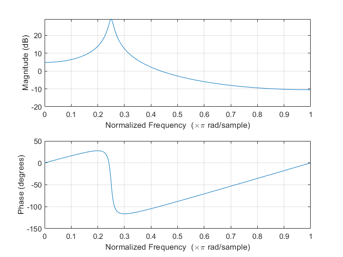

由幅频响应特性可见，有共振峰处于$0.25\pi = 0.7854\ \mathrm{rad}$上，符合理论计算。

**单位样值响应**

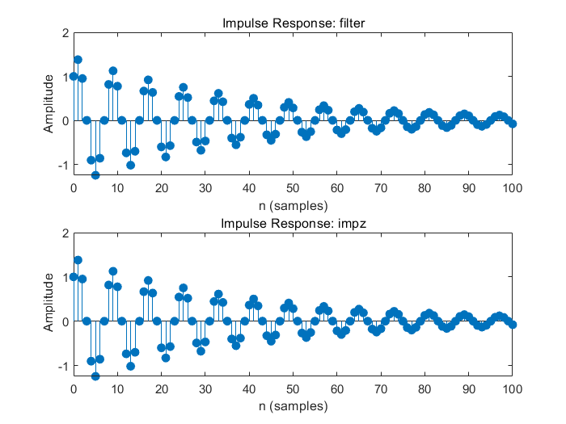

可以看到使用`filter`与`impz`得到的单位样值响应是一样的。

具体源代码如下：

```matlab
clear; clc; close all;

a = [1, -1.3789, 0.9506];

% Compute peak frequency
p = roots(a);
fprintf("Frequency: %f = %f * pi\n", angle(p(1)), angle(p(1)) / pi);

% Draw zero and pole points
figure;
zplane(1, a);

% Draw amplitude and phase with regard to frequency
figure;
freqz(1, a);

% Draw impulse response
figure;
% Use filter to generate impulse response
subplot(2, 1, 1);
n = (0:100)';
x = (n == 0);
y = filter(1, a, x);
stem(n, y, 'filled');
title('Impulse Response: filter');
xlabel('n (samples)');
ylabel('Amplitude');
% Use impz
subplot(2, 1, 2);
impz(1, a, 101);
title('Impulse Response: impz');
```

### (2) 阅读`speechproc.m`程序，理解基本流程

该程序基本流程如下：

1. 定义常数、载入语音
2. 定义各滤波器的激励、响应、状态变量，以及其它一些辅助变量
3. 依次处理每帧语音：
   1. 计算预测系数
   2. 进行到27帧时，观察零极点分布图
   3. 提取本帧语音`s_f`，使用`filter`函数和`s_f`计算激励`exc`，同时保持滤波器状态（下同）
   4. 使用`filter`函数和`exc`重建语音`s_rec`
   5. 计算基音周期`PT`和合成激励的能量`G`
   6. 利用`PT`和`G`生成合成激励，并用`filter`函数和合成激励重建语音`s_syn`
   7. 将合成激励长度增加一倍，再作为`filter`的输入，合成语音`s_syn_v`，实现变速不变调
   8. 将基音周期减小一半，共振峰频率增加150Hz，再作为`filter`的输入，合成语音`s_syn_t`，实现变调不变速
4. 听上述语音并保存

### (3) 观察27帧时零极点图

在`if n == 27`的条件后添加产生零极点图的代码：

```matlab
figure;
zplane(A, 1);
title('27帧时刻预测系统零极点分布图');
```

生成零极点图如下所示。

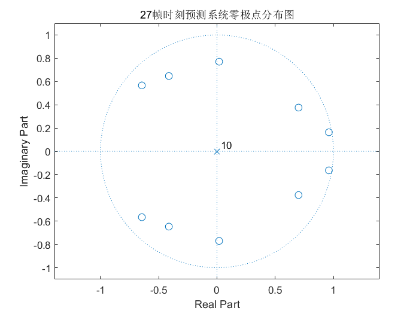

这里值得注意的是，预测模型与生成模型的激励、响应相反，因此输入`zplane`的参数应从`1,A`调换为`A,1`，即传递函数变为原先传递函数的倒数。零极点也与生成模型的零极点对调。27帧时，预测模型有10个单位圆内的零点，两两共轭，以及十重极点0。这对应于生成模型的五对共轭极点和十重零点0。这是典型的男声，含五个共振峰频率。

### (4) 计算激励信号

`[exc((n-1)*FL+1:n*FL), zi_pre] = filter(A, 1, s_f, zi_pre);`

使用`filter`将本帧语音`s_f`输入得到激励信号，通过`zi_pre`保持滤波器状态，使用上一帧留下的`zi_pre`作为本帧的`zi`，并将`zf`继续写入`zi_pre`。这里虽然每帧预测系统本身不同，但相邻两帧滤波器状态仍然不发生变化。

### (5) 重建语音

`[s_rec((n-1)*FL+1:n*FL), zi_rec] = filter(1, A, exc((n-1)*FL+1:n*FL), zi_rec);`

使用`filter`将激励信号输入得到重建的语音`s_rec`，因为合成系统与预测系统输入输出相反，传递函数互为倒数，因此`filter`中`A, 1`颠倒为`1, A`，同样要保持滤波器状态`zi_rec`。

### (6) 试听信号

使用`sound`函数试听原始信号`s`、激励信号`e`和合成信号`s_rec`。使用如下代码，此处将`s`、`exc`、`s_rec`三个列向量拼接在一起连续试听。这里需要注意的是，`sound`函数接收的是[-1, 1]范围的信号，传递给扬声器，而我们所处理的音频都为16bit，需要除去2^15将其限定在[-1, 1]范围中。同时如果不拼接在一起，则由于`sound`并非同步执行，不会阻塞其它指令，故听起来所有声音会重叠，需要`pause`相应时间等待上一个音频播放完毕。采样率`Fs = 8000;`。此处代码与提交的`speechproc.m`中不同，因为提交代码中试听所有六个音频，作六个音频的时域、频域图，下同。

`sound([s; exc; s_rec] / 2^15, Fs);`

`s`与`s_rec`应完全相同（经过预测系统及其逆系统生成系统保持不变），`exc`是经过声管前的激励。实际听上去，`s`与`s_rec`非常清晰，是一样的语音“电灯比油灯进步多了”；而`exc`虽然也能听出是这句话，但音量较轻，且听起来不够圆滑，是原始的气管气流激励，有较强的冲激音效，声音不够饱满。

作出`s`、`exc`、`s_rec`三个信号图如下图所示，由上至下依次为`s`、`exc`、`s_rec`（即$s(n)$、$e(n)$、$\hat{s}(n)$）。图中横纵坐标相统一以便于比较，下同。代码如下，其中`time`是由离散时间结合采样率转换为连续时间：

```matlab
figure;
time = (0:L-1) / Fs;    % 由采样率生成对应时间
subplot(3, 1, 1);
plot(time, s);
ylim([-2.5e4, 2.5e4]);
subplot(3, 1, 2);
plot(time, exc);
ylim([-2.5e4, 2.5e4]);
subplot(3, 1, 3);
plot(time, s_rec);
ylim([-2.5e4, 2.5e4]);
```

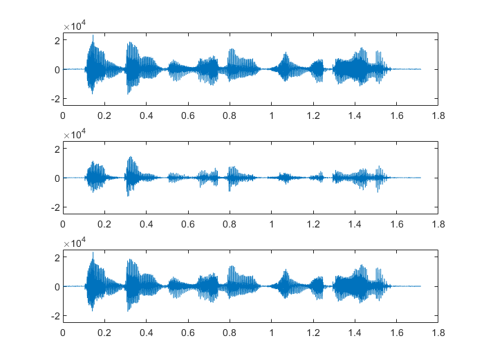

这也可以看出`s`和`s_rec`完全一致，而`exc`则幅度较小。

选择其中一小段，放大观看。选择的是0.3s-0.5s的时间，在采样率8000Hz时，对应的是第2400-4000个采样点。具体代码如下：

```matlab
figure;
subplot(3, 1, 1);
plot(time(2400:4000), s(2400:4000));
ylim([-2.5e4, 2.5e4]);
subplot(3, 1, 2);
plot(time(2400:4000), exc(2400:4000));
ylim([-2.5e4, 2.5e4]);
subplot(3, 1, 3);
plot(time(2400:4000), s_rec(2400:4000));
ylim([-2.5e4, 2.5e4]);
```

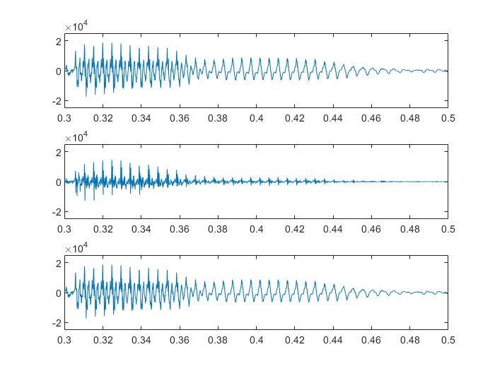

可以看出`s`和`s_rec`完全一致，在小范围中，语音信号有明显的周期特征。（这一段时间对应于第一个“灯”字，可看见明显有d，ɤ，ŋ三个音，其中d的能量最大，其余两个为鼻音，能量较小。而激励信号`exc`幅度较小，也对应于这三个音，而其毛刺更多，更像一系列冲激串，这符合气管中气流的特征。特别地，鼻音几乎没有气流冲击，主要是由先前的滤波器状态保持而发出声音的，这一点由0.44-0.46s中波形可以看出，`exc`已经几乎没有激励，而`s`和`s_rec`还保持了一段时间的周期声音。

我们还可以观察信号的频谱。使用`fft`函数，编写单边傅里叶变换的作图函数`fft_singleside_plot`，内容参考matlab官方文档中`fft`的说明。

```matlab
function fft_singleside_plot(x, Fs)
%FFT_SINGLESIDE_PLOT Plots single-side fft
%   fft_singleside_plot(x, Fs)
%   refer to document of fft
    L = length(x);
    f = (0:L/2) * Fs / L;           % frequency sample, half of length(x)
    y = abs(fft(x) / L);            % get amplitude
    y = y(1:L/2+1);                 % get single side
    y(2:end-1) = 2 * y(2:end-1);    % double the side
    plot(f, y);
end
```

作频谱如下图所示，由上至下同样依次为`s`、`exc`、`s_rec`。代码如下：

```matlab
figure;
subplot(3, 1, 1);
fft_singleside_plot(s, Fs);
ylim([0, 600]);
subplot(3, 1, 2);
fft_singleside_plot(exc, Fs);
ylim([0, 100]);
subplot(3, 1, 3);
fft_singleside_plot(s_rec, Fs);
ylim([0, 600]);
```

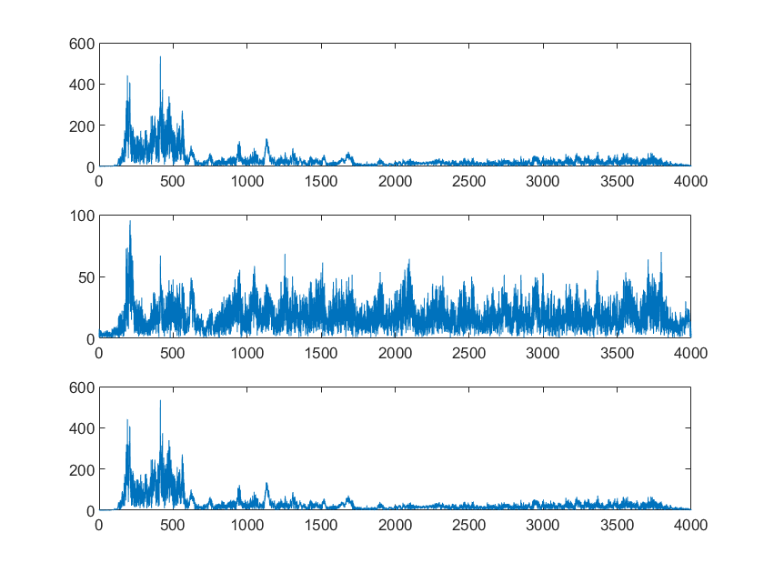

这里注意`exc`纵轴比例与其它两项不同，是因为其能量较低，此处放大观察。可以观察到`s`和`s_rec`（一样的信号）频率分量集中在600Hz以下，而其激励除一个200Hz左右的频率分量较大外，其余分量基本相同，均匀分布在200-4000Hz中。因此我们可以在激励中听到明显的噪声感。而经过生成系统后，其高频噪声被滤除，200Hz附近的冲激激励被加强，得到合成的语音。因此可以认为语音生成系统是一个有共振峰的低通系统。

## 语音合成模型

### (7) 生成基音周期固定的单位样值串

单位样值串如下所示，其采样率$f_s$，基音频率$f$，时长$t$，则有单位样值串中基音周期$N=\frac{f_s}{f}$，单位样值数目$NS=t f$。具体地，生成一个8kHz抽样，持续1秒钟的200Hz的单位样值串，有$N=\frac{8000}{200}=40$，$NS=1\times 200 = 200$。
$$
x(n) = \sum_{i=0}^{NS-1}\delta(n-iN)
$$
定义函数`siggen(f, Fs, dur)`，传入采样率$f_s$，基音频率$f$，时长$t$，生成单位样值串`sig`。这里注意，要考虑到$f_s$不为$f$整数倍，$t$不为整数等情况，要提高函数的鲁棒性。最终要将`sig`中的特定位（`p`）置1，首先`NS`要取整（信号长度），然后计算`p`的长度`k`，这要向下取整以免超出长度，然后乘以周期`N`后要取整。

```matlab
function sig = siggen(f, Fs, dur)
%SIGGEN Generates impulse train with frequency f, sampling rate Fs and
%duration dur
%   sig = siggen(f, Fs, dur)
    NS = round(Fs * dur);
    N = Fs / f;
    sig = zeros(NS, 1);
    k = floor((NS - 1) / N);
    p = round((0:k)*N) + 1;
    sig(p) = 1;
end
```

生成8kHz的时长1s，频率200Hz与300Hz的单位样值串各一并试听，代码如下。

```matlab
sig200 = siggen(200, 8000, 1);
sig300 = siggen(300, 8000, 1);
sound([sig200; sig300], 8000);
```

试听结果这基本是单频信号，但也有一些类似喇叭的杂音感，这是因为使用单位样值串而非正弦波会有明显的谐波产生。300Hz的音调比200Hz的听起来更高。

### (8) 生成基音周期时变的单位样值串

真实语音信号的基音周期时变。将信号分成若干个10毫秒长的段，假设每个段内基音周期固定不变，但段和段之间则不同，具体为$PT= 80+ 5\mathrm{mod}(m; 50)$，其中$PT$表示基音周期，$m$表示段序号。

采用循环逐段实现，每一个脉冲时间为上一个脉冲加上基音周期$PT$。具体地，代码如下：

```matlab
Fs = 8000;              % sampling rate
dur = 1;                % duration
t_seg = 10;             % time segment (ms)

% generate each pulse with while loop
NS = round(Fs * dur);
e = zeros(NS, 1);
p = 1;
while p <= NS
    e(p) = 1;
    m = ceil(p / (t_seg * Fs / 1000));
    PT = 80 + 5 * mod(m, 50);
    p = p + PT;
end
```

`e`为生成的样值串，`p`为当前脉冲的离散时间，采用循环控制下一个脉冲为`p = p + PT;`，其中`PT = 80 + 5 * mod(m, 50);`，`m`通过当前`p`与参数每段时长`t_seg`与采样率`Fs`计算，注意ms与s的换算。

采用如下代码画出时域波形及其频谱，如下图所示。

```
figure;
subplot(2, 1, 1);
plot((0:7999)/8000, e);
subplot(2, 1, 2);
fft_singleside_plot(e, 8000);
```

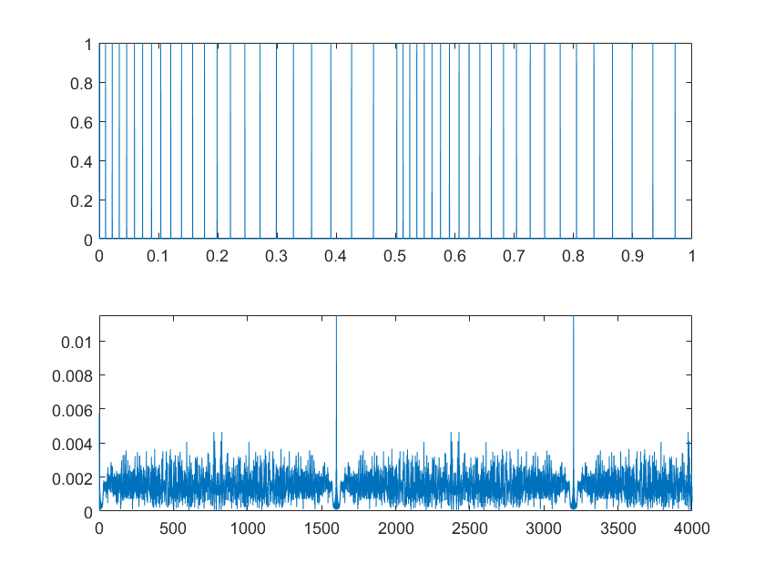

时域波形可以看到为基音周期变化的单位样值串，且过完50帧（0.5s）后，基音周期重置。频域上，可以观察到1600Hz和3200Hz处有两个冲激，这对应的是以5ms为周期的冲激串产生的频谱（0s后的前三个冲激与0.5s后的前三个冲激）。其余分量不明显，如0.5s的近似周期（周期不精确为0.5s因为0.5s内各`PT`的和略大于0.5s）对应的2Hz分量也有一定的高度。

试听该信号，`sound(e, Fs);`可以听到该声音类似于弹嘴唇发出的声音，声调逐渐变低，然后又恢复高声调再变低。

### (9) 将单位样值串通过系统生成输出

利用`filter`将`e`输入(1)中系统，即：

```matlab
a = [1, -1.3789, 0.9506];
s = filter(1, a, e);
```

画出时域波形及其频谱，如下图所示。

```matlab
figure;
subplot(2, 1, 1);
plot((0:Fs-1)/Fs, s);
subplot(2, 1, 2);
fft_singleside_plot(s, Fs);
```

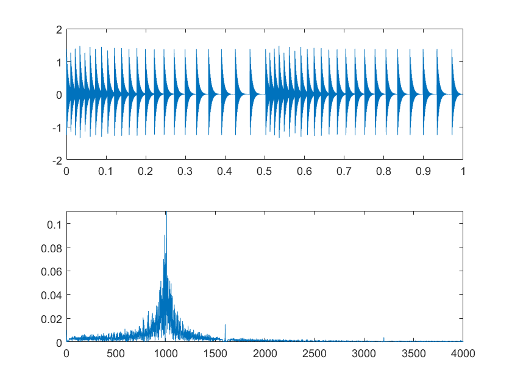

作局部图如下（0-0.1s）。

```matlab
figure;
plot((0:799)/Fs, s(1:800));
xlim([0, 799/Fs]);
```

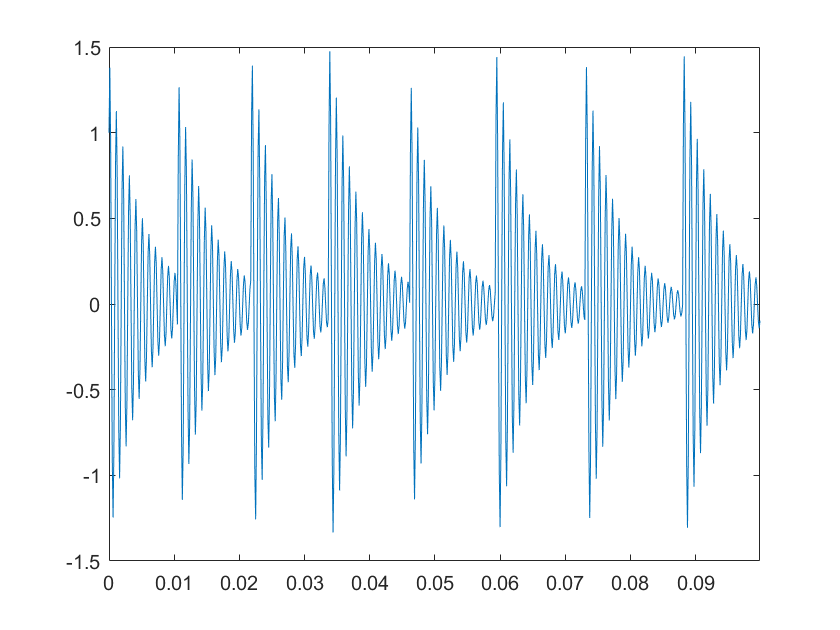

时域波形可以看到是在基音上产生出指数衰减正弦波。频域上可以看到，主要是(1)中的幅频响应的形状，而激励的频域被抑制（仍可见较矮的1600Hz分量），而有明显的峰值1000Hz（系统的共振峰）。

试听`sound(s/max(abs(s)), Fs);`，这里需要注意经过系统后音频幅值可能超过1，需要除去幅度的最大值`max(abs(s))`。结果可以听出声音明显更为圆润，这是因为在冲激串上叠加了正弦波的缘故。另外，声音像张开嘴的“哦”声，仍有同上的音调变化，直观上符合基音通过声管的效果。

### (10) 合成语音

利用计算得的基音周期（使用`findpitch`函数），生成合成激励信号$Gx(n)$，其中$G$是计算而得的增益。

```matlab
while p <= n*FL
    exc_syn(p) = 1;
    p = p + PT;
end
        
[s_syn((n-1)*FL+1:n*FL), zi_syn] = filter(G, A, exc_syn((n-1)*FL+1:n*FL), zi_syn);
```

以上代码中上半部分循环在该帧中利用计算而得的基音周期，产生单位冲激串，其中初始的`p = 2*FL + 1`在第三帧的开始处。然后将合成的单位冲激串`exc_syn`作为激励送入生成系统，并定义滤波器状态`zi_syn`，同时保持滤波器状态，方法同上。注意这里有增益`G`，因此滤波器传递函数应传入`G, A`。

作时域波形、局部波形、频谱如下所示。以下每一张图上图为原始信号`s`，下图为合成信号`s_syn`。

```matlab
figure;
time = (0:L-1) / Fs;    % 由采样率生成对应时间
subplot(2, 1, 1);
plot(time, s);
ylim([-2.5e4, 2.5e4]);
subplot(2, 1, 2);
plot(time, s_syn);
ylim([-2.5e4, 2.5e4]);
    
figure;
subplot(2, 1, 1);
plot(time(2400:4000), s(2400:4000));
ylim([-2.5e4, 2.5e4]);
subplot(2, 1, 2);
plot(time(2400:4000), s_syn(2400:4000));
ylim([-2.5e4, 2.5e4]);

figure;
subplot(2, 1, 1);
fft_singleside_plot(s, Fs);
ylim([0, 600]);
subplot(2, 1, 2);
fft_singleside_plot(s_syn, Fs);
ylim([0, 600]);
```


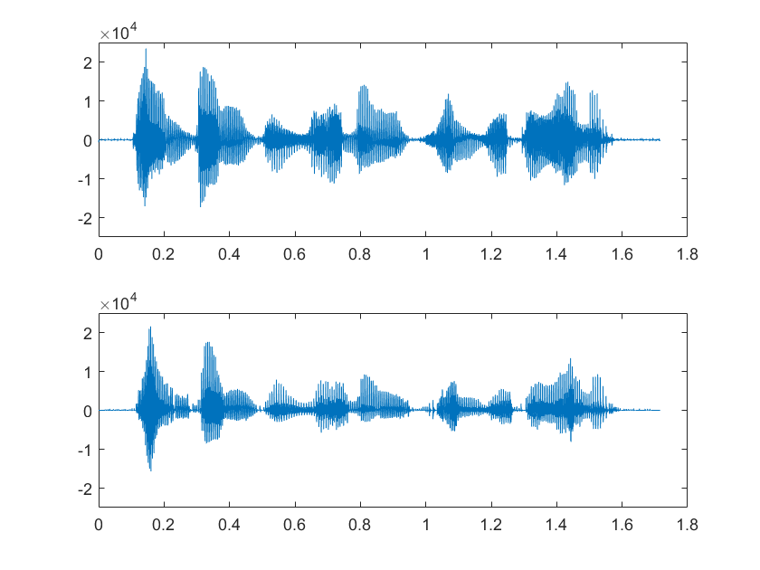

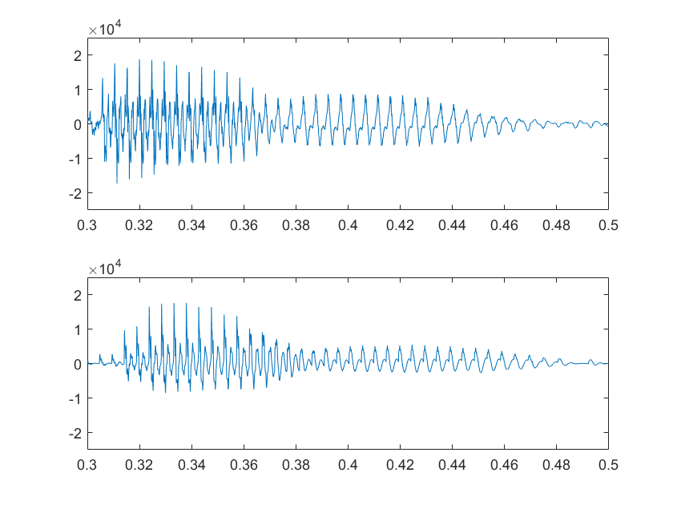

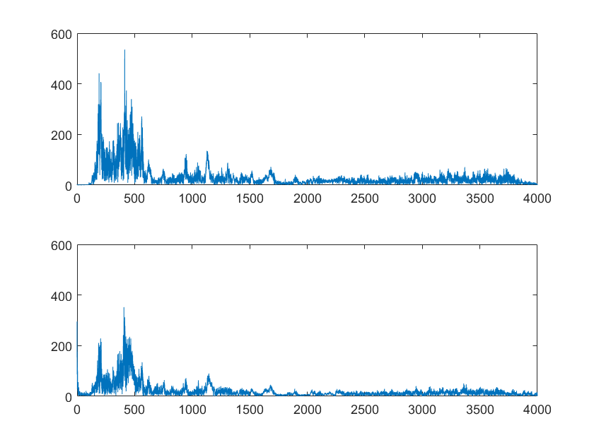

可以观察到，合成语音`s_syn`波形大致与原始信号`s`相近，其区别在于：`s_syn`振幅略小（可能是增益`G`计算不够准确），且反方向振幅更小，不如原始语音对称。具体到局部波形，“灯”字的d音合成波形有明显包络，不同于原始语音，而后两个鼻音大致一致（除振幅较小），这可能是因为基音周期和模型本身过于简略产生的不同。至于频域，形状大致一致，幅度较小，两个明显的共振峰形状有较小的区别。

试听`sound([s; s_syn] / 2^15, Fs);`可以听出二者基本接近，但合成语音略微有一些杂音，除此之外难以听出区别。

## 变速不变调

### (11) 合成慢一倍的语音

合成变速不变调的语音将合成激励的帧长增加一倍（变为20ms一帧），并使用相同的方法合成语音，即可使语音变慢一倍，而音调不变。

```matlab
while p_v <= n*FL_v
    exc_syn_v(p_v) = 1;
    p_v = p_v + PT;
end
        
[s_syn_v((n-1)*FL_v+1:n*FL_v), zi_syn_v] = filter(G, A, exc_syn_v((n-1)*FL_v+1:n*FL_v), zi_syn_v);
```

这里定义帧长`FL_v = 2*FL;`是原始帧长的两倍，初始基音位置`p_v = 2*FL_v + 1;`是较长的帧的第三帧最开始。而`PT`不变使得基音周期不变，能够使得合成的音调不变。送入同样的合成系统，并保持滤波器状态`zi_syn_v`。

作时域波形、局部波形、频谱如下所示。这里的对比对象是合成信号`s_syn`（因为它们是用相同的模型合成的），更有对比意义。注意这里生成两个时域波形时间有所不同，定义`time_v = (0:2*L-1) / Fs;`是两倍长度的总时间，而局部波形取样本点范围4800-8000（对应0.6s-1s），它的内容应和合成信号中的0.3-0.5s对应的内容相同。以下每一张图上图为原始信号`s_syn`，下图为变速不变调信号`s_syn_v`。

```matlab
figure;
time = (0:L-1) / Fs;    % 由采样率生成对应时间
subplot(2, 1, 1);
plot(time, s);
ylim([-2.5e4, 2.5e4]);
subplot(2, 1, 2);
time_v = (0:2*L-1) / Fs;
plot(time_v, s_syn_v);
ylim([-2.5e4, 2.5e4]);
    
figure;
subplot(2, 1, 1);
plot(time(2400:4000), s(2400:4000));
ylim([-2.5e4, 2.5e4]);
subplot(2, 1, 2);
plot(time_v(4800:8000), s_syn_v(4800:8000));
ylim([-2.5e4, 2.5e4]);

figure;
subplot(2, 1, 1);
fft_singleside_plot(s, Fs);
ylim([0, 600]);
subplot(2, 1, 2);
fft_singleside_plot(s_syn_v, Fs);
ylim([0, 600]);
```

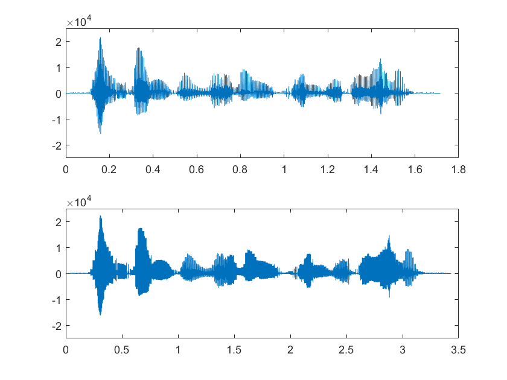

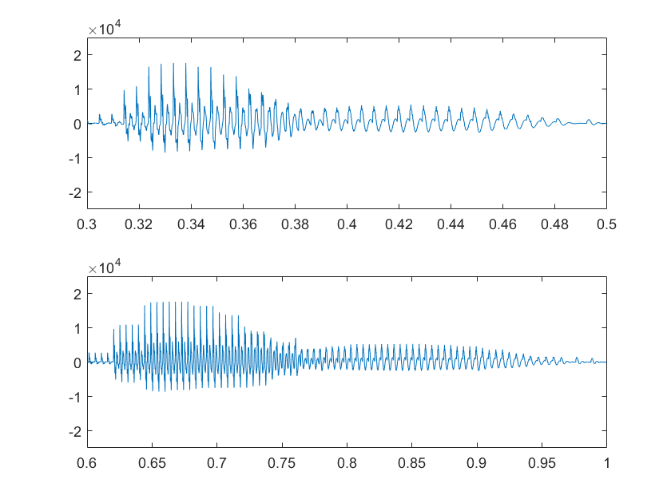

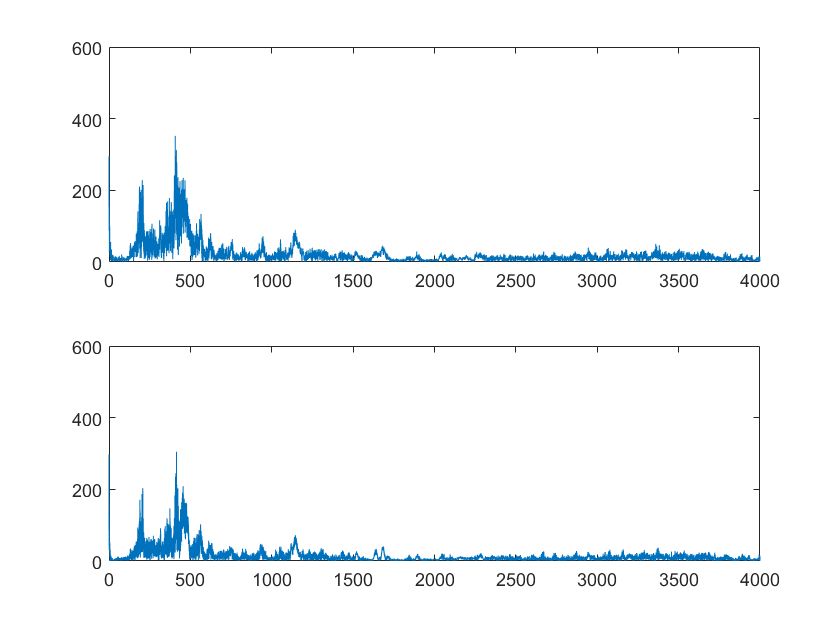

观察时域波形，可以注意到二者几乎一致，但横轴时间范围不同，可见变速不变调的波形时长长了一倍。局部中可见虽然总体包络一致，但内部脉冲数量增加了一倍，这表明基音频率不变，即不变调。这一点更容易从频域波形中看出，两者频域几乎一致，表明未变调。

试听`sound([s; s_syn_v] / 2^15, Fs);`，二者音调基本一致，而变速不变调的语音时长延长了一倍，达到目的。变调不变速的语音仍有轻微杂音，同样来自于语音生成系统。

## 变调不变速

### (12) 提高系统共振峰频率

定义函数`peak_rise`用以提升极点多项式的共振峰，输入极点多项式`a`，提升频率`f`，采样率`Fs`，输出新的极点多项式`a_new`。

```matlab
function a_new = peak_rise(a, f, Fs)
%PEAK_RISE Rises formant of poles polynomial A with frequency f and sampling rate Fs
%   A_new = peak_rise(A, f, Fs)
    theta = 2 * pi * f / Fs;
    p = roots(a);       % find all poles of polynomial a
    p_new = p .* exp(theta * sign(imag(p)) * 1j);  % rotate poles with angle theta depending on sign of imag(p)
    a_new = poly(p_new) * a(1); % times a(1) to get a_new(1) = a(1)
end
```

函数如上所示，首先计算z平面上转过的角度`theta`，由于z平面上$\pi$对应$\frac{f_s}{2}$，因此`theta = 2 * pi * f / Fs`。然后利用`roots`求解极点，再对每个极点进行旋转，旋转通过乘以`exp(theta * sign(imag(p)) * 1j)`完成，这能够做到上半平面极点逆时针旋转$\theta$（`sign(imag(p))`为1），下班平面极点顺时针旋转$\theta$（`sign(imag(p))`为-1），实轴上极点不动（`sign(imag(p))`为0）。最后使用`poly`将极点转为多项式，并乘以首项系数`a(1)`。

用该函数提高(1)中系统共振峰频率150Hz，即`a_new = peak_rise(a, 150, 8000);`。可得`a1 = 1.207284, a2 = -0.950600`。同样作零极点图、频率响应、单位样值响应。

**零极点图**


两个极点均旋转过了$\theta = 2 \pi \times 150 / 8000 = 0.0375 \pi \ \mathrm{rad}$。

**频率响应**

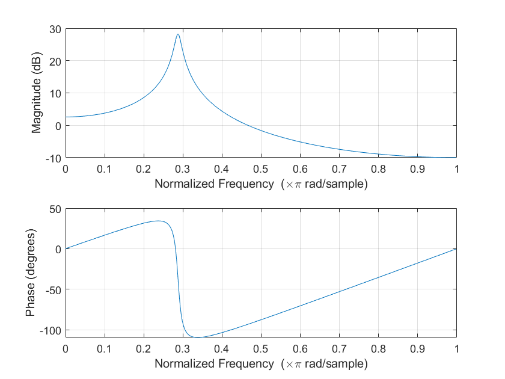

由幅频响应特性可见，有共振峰提高了$\theta = 0.0375 \times \pi \ \mathrm{rad/sample}$至$0.2875\times \pi \ \mathrm{rad/sample}$。

**单位样值响应**

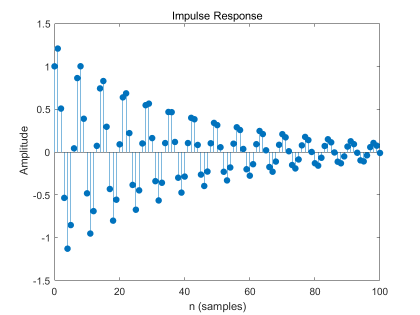

与先前相比，单位样值响应频率变高了（图中可见15个波峰，原先只有13个），表明共振峰频率加高了。

### (13) 合成基音周期减小一半，共振峰频率增加150Hz的语音

合成变调不变速的语音将基音周期减小一半，并将所有共振峰频率增加150Hz，然后使用相同的方法合成语音，即可使音调增加一倍，共振峰频率增加150Hz，而速度不变。

```matlab
while p_t <= n*FL
    exc_syn_t(p_t) = 1;
    p_t = p_t + round(PT/2);
end
        
A_new = peak_rise(A, 150, Fs);
[s_syn_t((n-1)*FL+1:n*FL), zi_syn_t] = filter(G, A_new, exc_syn_t((n-1)*FL+1:n*FL), zi_syn_t);
```

这里定义初始基音位置`p_t = 2*FL + 1;`是第三帧最开始。而`PT`使用`round(PT/2)`替代，使基音周期减小一半。将`A`用`peak_rise`增加共振峰频率150Hz得到`A_new`。滤波器中`A`用`A_new`替代，并保持滤波器状态`zi_syn_t`，即得到变调不变速的语音`s_syn_t`。

作时域波形、局部波形、频谱如下所示。这里的对比对象仍是合成信号`s_syn`。以下每一张图上图为原始信号`s_syn`，下图为变调不变速信号`s_syn_t`。

```matlab
figure;
time = (0:L-1) / Fs;    % 由采样率生成对应时间
subplot(2, 1, 1);
plot(time, s);
ylim([-2.5e4, 2.5e4]);
subplot(2, 1, 2);
plot(time, s_syn_t);
ylim([-2.5e4, 2.5e4]);
    
figure;
subplot(2, 1, 1);
plot(time(2400:4000), s(2400:4000));
ylim([-2.5e4, 2.5e4]);
subplot(2, 1, 2);
plot(time(2400:4000), s_syn_t(2400:4000));
ylim([-2.5e4, 2.5e4]);

figure;
subplot(2, 1, 1);
fft_singleside_plot(s, Fs);
ylim([0, 600]);
subplot(2, 1, 2);
fft_singleside_plot(s_syn_t, Fs);
ylim([0, 600]);
```

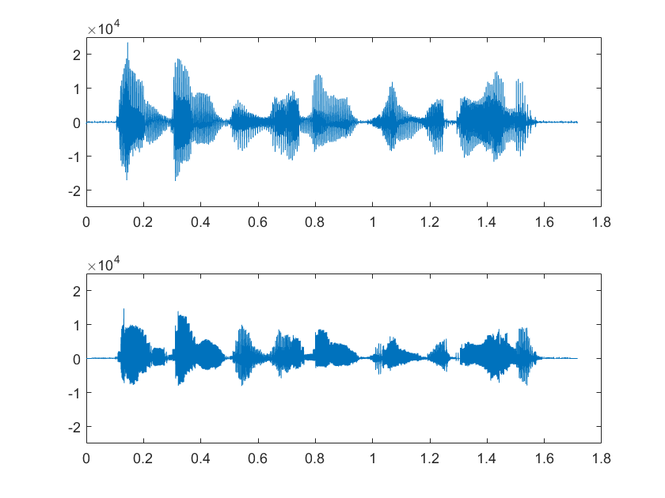

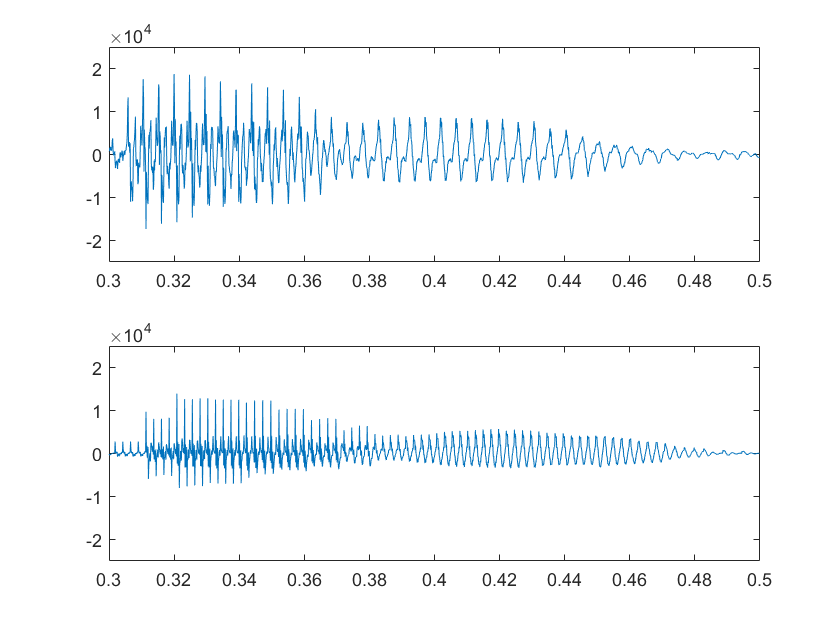

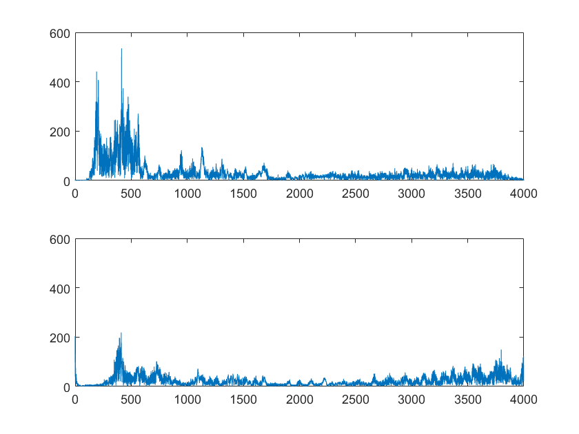

观察时域波形，波形有了明显变化，变得更密，同时由于共振峰的提升，整体包络也有所区别。对于局部时域波形，可见波形明显更密（基音周期变为原来一半），同时波形本身也有一定区别，这是由于共振峰改变带来的影响，但总体而言还是可以区分局部波形的三个音。对于频域，明显高频分量增加，但原先低频两个峰值只剩下一个明显的峰值，这也是共振峰的影响。

试听`sound([s; s_syn_t] / 2^15, Fs);`，变调不变速的语音音调更高而时长不变，达成目的，但总体来说听起来仍不够自然，不像女声，这是因为我们使用的模型过于简略的缘故。

## 原创性

全部为原创。

## 实验代码

代码文件夹中含如下文件：

- `*.pcm`：各语音文件
- `speechproc.m`：主函数，包括(2)、(3)、(4)、(5)、(6)、(10)、(11)、(13)题代码
- `code_1_1.m`：第(1)题代码
- `code_2_7.m`：第(7)题代码
- `code_2_8.m`：第(8)、(9)题代码
- `code_4_12.m`：第(12)题代码
- `siggen.m`：第(7)题中用于生成基音周期固定的单位样值串的函数，具体见说明（下同）
- `peak_rise.m`：第(12)、(13)题中用于提高共振峰频率的函数
- `fft_singleside_plot.m`：绘制单边傅里叶频域图的函数

